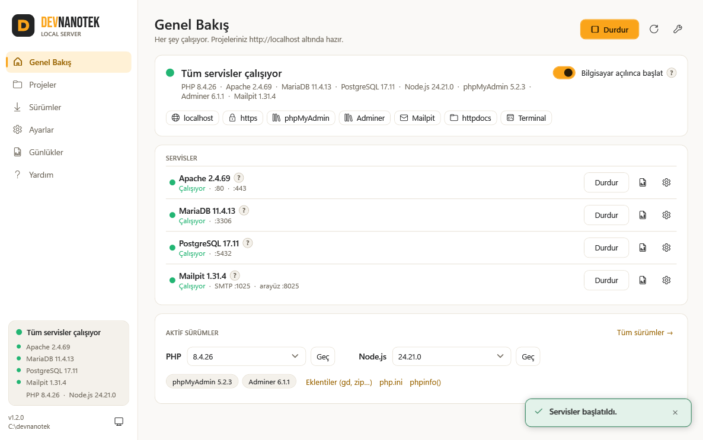
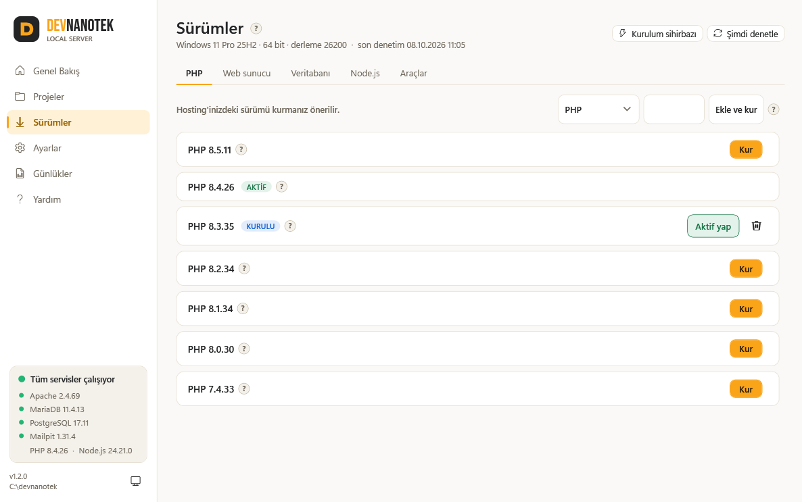
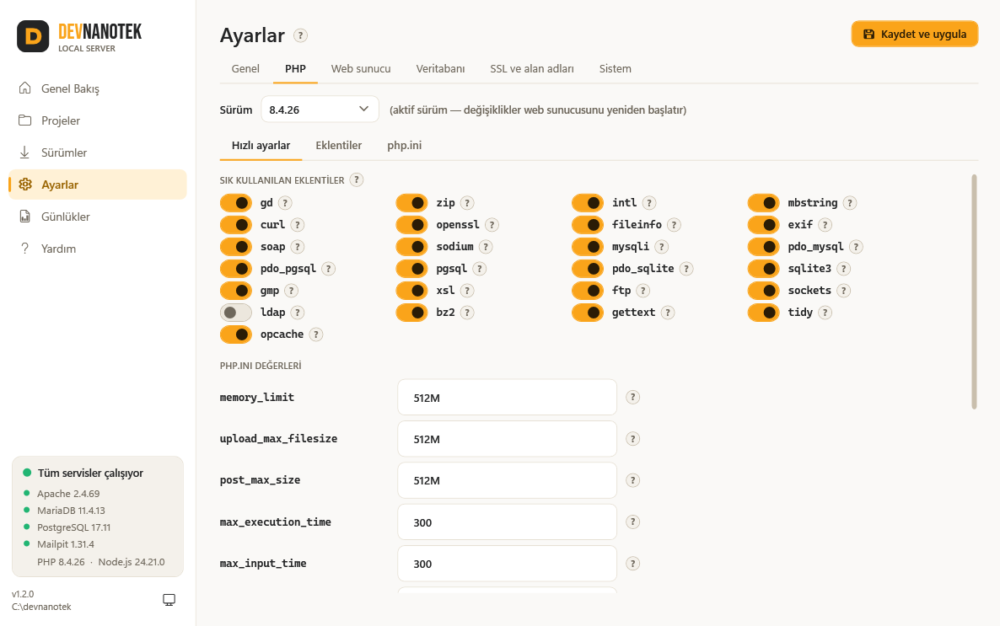
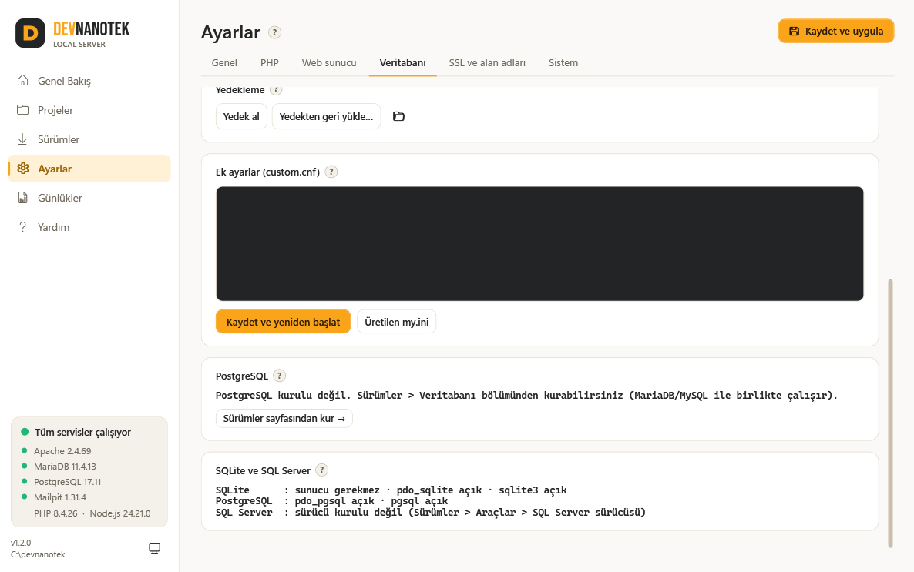
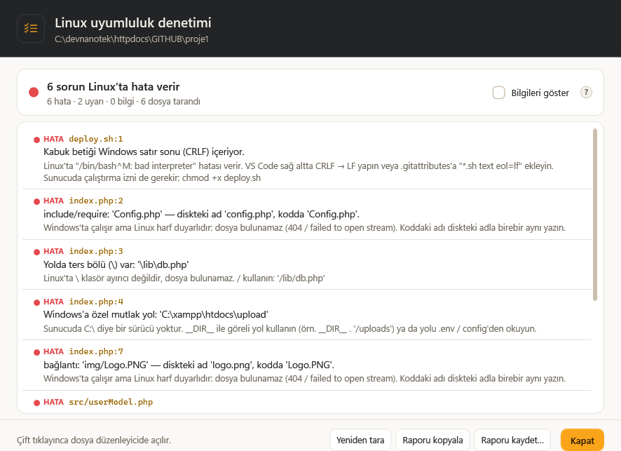

<p align="center">
  <a href="https://devnanotek.github.io/local-server/"></a>
</p>

<h1 align="center">DEVNANOTEK Local Server</h1>

<p align="center">
  Windows ve Linux için ücretsiz, açık kaynak yerel PHP geliştirme ortamı — XAMPP ve Laragon'a alternatif.<br>
  <sub>Free, open-source local PHP development stack for Windows and Linux. <a href="#english">English ↓</a></sub>
</p>

<p align="center">
  <a href="https://github.com/devnanotek/local-server/releases/latest"></a>
  <a href="https://github.com/devnanotek/local-server/releases"></a>
  <a href="LICENSE"></a>
  <a href="https://github.com/devnanotek/local-server/actions/workflows/build.yml"></a>
</p>

<p align="center">
  <a href="https://github.com/devnanotek/local-server/releases/latest/download/DevNanotek.exe"><b>⬇ Windows için indir</b></a>
  &nbsp;·&nbsp;
  <a href="#linux">Linux'a kur</a>
  &nbsp;·&nbsp;
  <a href="https://devnanotek.github.io/local-server/">Proje sitesi</a>
  &nbsp;·&nbsp;
  <a href="https://devnanotek.github.io/local-server/kilavuz.html">Kılavuz</a>
  &nbsp;·&nbsp;
  <a href="https://devnanotek.github.io/local-server/guide.html">Guide (EN)</a>
</p>

<p align="center">
  <picture>
    <source media="(prefers-color-scheme: dark)" srcset="site/assets/img/dashboard-dark.png">
    
  </picture>
</p>

## Neler var?

- **PHP 7.4 – 8.5**: birden çok sürüm yan yana kurulur, tek tıkla geçilir. gd, zip, intl gibi eklentiler anahtarla açılıp kapanır.
- **Apache 2.4** (.htaccess, mod_rewrite — cPanel / Plesk ile aynı) veya **Nginx**.
- **Veritabanları:**
  - **MariaDB** veya **MySQL** (sürüm seçilebilir)
  - **PostgreSQL** 14–18 (MariaDB/MySQL ile birlikte çalışır)
  - **SQLite** (PHP'de hazır)
  - **SQL Server** PHP sürücüsü + ODBC Driver 18
- **phpMyAdmin** ve hepsini yöneten **Adminer** (`/adminer`, yerelde şifresiz giriş).
- **Mailpit** (test e-posta kutusu), **mkcert** (uyarısız `https://localhost`), **Composer**, **Node.js**.
- **Linux uyumluluk denetimi:** proje sunucuya gitmeden önce taranır; şunları bulur:
  - büyük/küçük harf uyumsuz yollar, ters bölü ve `C:\` yolları
  - karışık harfli tablo adları
  - `.htaccess`'te `php_value`
  - CRLF satır sonlu betikler
- **Kendini güncel tutar:**
  - Yeni PHP, MariaDB, Node.js… sürümlerini bulur ve **ÖNERİLEN** sürümü işaretler.
  - DEVNANOTEK'in yeni sürümünü GitHub'dan görür ve tek tıkla güncellenir.
- **Gerçek Windows servisleri:** çökünce yeniden başlar, program kapalıyken de çalışır.
- **Alt klasörler doğrudan açılır:** `C:\devnanotek\httpdocs\GITHUB\proje1` → `http://localhost/GITHUB/proje1/`.
- **Türkçe ve İngilizce arayüz:** program Windows'un diline göre açılır (Windows Türkçe değilse İngilizce). **Ayarlar → Genel → Dil / Language**'dan istediğiniz zaman değişir; bildirimler, günlükler, komut satırı, localhost açılış sayfası ve kılavuz da aynı dilde olur.
- **Sade arayüz:**
  - Gündüz / gece teması; açıklamalar "?" simgelerinde.
  - Renkli durum (yeşil / sarı / kırmızı) ve tepsi simgesi.
  - İlk açılışta kurulum sihirbazı.
- **Onarım ve temiz kaldırma:**
  - Hızlı onarımdan fabrika ayarlarına dört seviye.
  - Kaldırınca servis, hosts, PATH, sertifika ve güvenlik duvarı kaydı kalmaz.
  - Projeleri ve veritabanlarını korumak isteğe bağlıdır.

<table>
  <tr>
    <td></td>
    <td></td>
  </tr>
  <tr>
    <td></td>
    <td></td>
  </tr>
</table>

## Kurulum

### Windows

1. **[DevNanotek.exe](https://github.com/devnanotek/local-server/releases/latest/download/DevNanotek.exe)** dosyasını indirip çalıştırın ve yönetici iznini onaylayın.
2. Program kendini `C:\devnanotek\app` altına kurar ve masaüstüne kısayol ekler.
3. Kurulum sihirbazında sürümleri seçip **Kur ve başlat**'a tıklayın.
4. Tarayıcıda `http://localhost` adresini açın. phpMyAdmin `http://localhost/phpmyadmin` adresindedir (kullanıcı `root`, şifre boş).

Gereksinimler:

- Windows 10 / 11 (64 bit, 32 bit veya ARM64; mimari kendiliğinden algılanır).
- Yönetici izni ve internet bağlantısı (bileşenler resmi kaynaklarından indirilir).
- .NET Framework 4.8 (Windows 10/11'de hazır gelir).

> **"Windows bilgisayarınızı korudu" uyarısı:** Program ücretsiz olduğu için ücretli kod imzası yoktur. **Ek bilgi → Yine de çalıştır** ile açın. Dosyayı sürüm sayfasındaki `SHA256SUMS.txt` ile doğrulayabilirsiniz: `certutil -hashfile DevNanotek.exe SHA256`
>
> **Akıllı Uygulama Denetimi (Smart App Control):** Windows 11'de açıksa imzasız programları (Apache DLL'leri, Nginx, Mailpit, DevNanotek.exe) engeller. Program bunu algılar ve ne yapılabileceğini gösterir; ayrıntılar kılavuzun "Sorun giderme" bölümünde.

### Linux

Ubuntu, Debian, Linux Mint, Pop!_OS, AlmaLinux, Rocky, RHEL, CentOS Stream, Oracle Linux ve Fedora'da aynı ortamı kurar:

```bash
curl -fsSLO https://github.com/devnanotek/local-server/releases/latest/download/devnanotek.sh && sudo bash devnanotek.sh install
```

Kurulumdan sonra `devnanotek` komutuyla yönetilir (`devnanotek status`, `sudo devnanotek php 8.3`, `sudo devnanotek ext enable gd`, `sudo devnanotek menu` …). Ayrıntılar: [linux/KURULUM.md](linux/KURULUM.md). Betik Windows programına da gömülüdür (**Yardım → Linux sürümünü al**).

### Mimari desteği

| Windows | İndirilen | Sınır |
|---|---|---|
| 64 bit Windows 10 / 11 | x64 | yok |
| ARM64 Windows 11 | x64 (emülasyon) | yok |
| ARM64 Windows 10, 32 bit Windows 10 | x86 | MariaDB, MySQL, PostgreSQL, Mailpit ve mkcert 32 bit için yayınlanmıyor. Node.js en fazla 22. |

## Klasör yapısı (çalışma zamanı)

```
C:\devnanotek\
  httpdocs\   projeleriniz (localhost)
  app\        DevNanotek.exe
  bin\        php, apache, nginx, mariadb, mysql, postgresql, nodejs, phpmyadmin, adminer, mailpit, mkcert, composer, winsw
  data\       veritabanı dosyaları (her dalın kendi klasörü)
  etc\        üretilen yapılandırmalar + sizin custom.conf / custom.cnf dosyalarınız
  logs\       tüm günlükler
  backups\    veritabanı yedekleri
```

## Kaynak koddan derleme

Gerekenler: Windows ve .NET SDK 8 veya üstü (`winget install Microsoft.DotNet.SDK.8`). Çıktı .NET Framework 4.8'i hedefler; kullanıcı bilgisayarına ek bir şey kurmak gerekmez.

```bash
powershell -ExecutionPolicy Bypass -File build.ps1
```

Çıktı tek bir dosyadır: `dist\DevNanotek.exe` (AnyCPU; 32 ve 64 bit Windows'ta aynı dosya çalışır). Marka simgesini yeniden üretmek için: `powershell -ExecutionPolicy Bypass -File tools\make-icon.ps1`

### Yeni sürüm yayınlama

1. [CHANGELOG.md](CHANGELOG.md) dosyasına `## [1.3.0] - YYYY-AA-GG` bölümünü ekleyin.
2. Etiketi gönderin: `git tag v1.3.0` ve `git push origin v1.3.0`. Ya da GitHub → **Actions → Sürüm yayınla → Run workflow** ile sürüm numarasını girin.
3. GitHub Actions programı o sürüm numarasıyla derler. Ardından şunları **Releases**'a yükler:
   - `DevNanotek.exe`, `devnanotek.sh`, kılavuz
   - `SHA256SUMS.txt`
4. Kurulu programlar yeni sürümü kendiliğinden görür. Proje sitesi de sürüm listesini GitHub'dan çeker.

### Proje sitesi

`site/` klasörü GitHub Pages'e [pages.yml](.github/workflows/pages.yml) ile yayınlanır. Kılavuz ve CHANGELOG da siteye kopyalanır. İlk kez: depo → **Settings → Pages → Source: GitHub Actions**.

## Kod yapısı

| Klasör / dosya | Görev |
|---|---|
| `Core\Stack.cs` | Orkestratör: yapılandırmayı üretir, servisleri kurar, başlatır ve durdurur |
| `Core\ApacheManager.cs`, `NginxManager.cs` | httpd.conf / nginx.conf ve sanal host üretimi, servis kurulumu |
| `Core\DbManager.cs` | my.ini, veri dizini, MariaDB/MySQL servisi, yedekleme, root şifresi |
| `Core\PostgreSqlManager.cs` | PostgreSQL: initdb, yapılandırma, `pg_ctl register` servisi, yedekleme |
| `Core\DbTools.cs` | Adminer (şifresiz yerel giriş) ve SQL Server sürücüsü + ODBC Driver 18 |
| `Core\LinuxCompat.cs` | Linux uyumluluk tarayıcısı (Projeler → Linux uyumluluğu, `--linux-check`) |
| `Core\AppInfo.cs` | GitHub deposu bilgisi, program güncellemesi (Releases) |
| `Core\Lang.cs`, `Core\Lang\En.*.cs`, `Views\Localizer.cs` | Arayüz dili: Türkçe kaynak metinler, İngilizce sözlük, ekranda çeviri (`tools\i18n-check` eksik çeviriyi denetler) |
| `Core\PhpManager.cs` | php.ini düzenleme, eklentiler, Apache modülü |
| `Core\ToolsManager.cs` | phpMyAdmin, Mailpit, mkcert (SSL), Composer, Node, VC++ Runtime |
| `Core\Catalog.cs`, `UpdateChecker.cs` | Çevrim içi sürüm kataloğu, önerilen sürüm seçimi, güncelleme denetimi ve uygulama |
| `Core\Installer.cs`, `Downloader.cs` | İndirme, zip açma, bozuk dosyada yeniden deneme |
| `Core\SystemInfo.cs`, `SystemCheck.cs` | Windows sürümü, mimari algılama, Akıllı Uygulama Denetimi |
| `Core\SecurityHelpers.cs` | Güvenlik duvarı kuralları, Defender istisnası, tepsi kaydı, ısıtma |
| `Core\WindowsServices.cs`, `WinSwManager.cs`, `FcgiSpawner.cs` | Windows servisleri; Nginx/Mailpit için WinSW; Nginx modunda php-cgi havuzu |
| `Core\HostsFile.cs`, `EnvPath.cs`, `Autostart.cs`, `SelfInstall.cs` | hosts, PATH, oturum açılışında başlatma, kendini kurma |
| `Core\ResetManager.cs`, `Uninstaller.cs` | Onarım / sıfırlama, kaldırma ve Denetim Masası kaydı |
| `Themes\*`, `Views\*` | WPF arayüzü, gündüz / gece paletleri |
| `Resources\*` | Yapılandırma şablonları, localhost açılış sayfası, kılavuz |
| `linux\devnanotek.sh` | Linux sürümü: kurulum ve yönetim betiği (bash) |
| `site\` | Proje sitesi (GitHub Pages) |

## Komut satırı

```bash
DevNanotek.exe --status
```

Diğer parametreler:

- Servisler: `--start-all`, `--stop-all`, `--apply`, `--config-only`
- Kurulum: `--install-defaults`, `--install php mariadb node`, `--install php:8.3.30`, `--install postgresql adminer sqlsrv`
- Sürüm denetimi: `--check-updates`
- Linux uyumluluk raporu: `--linux-check <klasör>`
- Onarım ve mod: `--reset quick|full|db|factory`, `--mode always|manual`
- Kaldırma: `--uninstall [--quiet [--all]]`, `--uninstall-system`

## Katkı ve destek

- Hata ve öneriler: [Issues](https://github.com/devnanotek/local-server/issues)
- Katkı rehberi: [CONTRIBUTING.md](CONTRIBUTING.md)
- Güvenlik bildirimi: [SECURITY.md](SECURITY.md)

## Lisans

[MIT](LICENSE) © DEVNANOTEK — kişisel ve ticari projelerde serbestçe kullanılabilir.

Arayüzdeki Bebas Neue yazı tipi SIL Open Font License 1.1 ile lisanslıdır (`src/DevNanotek/Assets/Fonts/OFL-BebasNeue.txt`). İndirilen bileşenler kendi lisanslarıyla resmi kaynaklarından alınır: PHP, Apache, MariaDB, MySQL, PostgreSQL, Nginx, Node.js, phpMyAdmin, Adminer, Mailpit, mkcert, Composer, WinSW ve Microsoft SQL Server sürücüleri.

---

<a id="english"></a>

## English

**DEVNANOTEK Local Server** is a free, open-source (MIT) local PHP development stack, an alternative to XAMPP and Laragon. The app is available in **English and Turkish**: it follows your Windows display language (English unless Windows is in Turkish), and you can switch it any time in **Settings → General → Language**. Full English guide: [guide.html](https://devnanotek.github.io/local-server/guide.html).

**Highlights**

- **PHP and web server:** multiple PHP versions (7.4–8.5) with one-click switching and extension toggles (gd, zip, intl…); Apache (.htaccess) or Nginx.
- **Databases:** MariaDB or MySQL, plus PostgreSQL 14–18, SQLite and the SQL Server driver. phpMyAdmin and Adminer.
- **Tools:** Mailpit test inbox, trusted local HTTPS with mkcert, Composer, Node.js.
- **Runs as Windows services:** your sites stay up even when the app is closed.
- **Linux compatibility checker:** flags case-sensitivity problems, backslash and `C:\` paths, mixed-case table names, `php_value` in .htaccess, and CRLF scripts before you deploy to a Linux server.
- **Stays up to date:** finds new component versions and new app releases from GitHub.
- **Clean removal:** leaves no services, hosts or PATH entries, certificates or firewall rules behind.

**Install**

- **Windows 10/11** (x64, x86, ARM64): download [DevNanotek.exe](https://github.com/devnanotek/local-server/releases/latest/download/DevNanotek.exe), run it and accept the admin prompt. The setup wizard installs the recommended versions. The file is not code-signed, so choose *More info → Run anyway* on the SmartScreen prompt.
- **Linux** (Ubuntu, Debian, Mint, AlmaLinux, Rocky, RHEL, CentOS Stream, Fedora):

  ```bash
  curl -fsSLO https://github.com/devnanotek/local-server/releases/latest/download/devnanotek.sh && sudo bash devnanotek.sh install
  ```

**Build from source:** Windows + .NET SDK 8, then `powershell -ExecutionPolicy Bypass -File build.ps1` → `dist\DevNanotek.exe`.

**Releases:** push a `vX.Y.Z` tag (with a matching CHANGELOG section) and GitHub Actions builds and publishes the release.

Project site: <https://devnanotek.github.io/local-server/> · License: [MIT](LICENSE)
